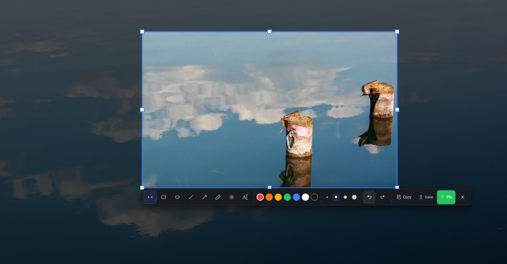

# glint-screenshot

A screenshot and pin-to-screen tool for GNOME on Wayland. Drag a region, get a
magnifier and color picker, mark it up with shapes / text / mosaic, then copy,
save, or pin the snippet to the desktop as a floating window.

Wayland-only — no X11 code, no XWayland fallback. Capture goes through the
XDG Desktop Portal; pinning uses gtk4-layer-shell where the compositor supports
it.

## Why

I wanted a screenshot tool on GNOME/Wayland with a magnifier, quick on-screen
annotation, and the ability to pin a snippet on top of everything. The existing
options were either X11-only, didn't do pinning, or just didn't feel snappy —
so I wrote one in Rust + GTK4.

## Status

Early. v0.1.0, tested on Ubuntu 24.04 / GNOME 46. The pin window's
always-on-top only works on compositors that implement wlr-layer-shell
(Sway / Hyprland / KDE); on GNOME a pin is a normal borderless window brought
to front — see Limitations below.

## Install

.deb (Ubuntu/Debian):

    sudo dpkg -i glint-screenshot_0.1.0-1_amd64.deb
    glint-setup-shortcut   # registers Ctrl+Alt+A

The .deb bundles libgtk4-layer-shell (not in Ubuntu apt), so it's
self-contained. Re-login (or run glint-screenshot --daemon) to start the
autostart daemon.

From source:

    sudo apt install libgtk-4-dev libadwaita-1-dev libcairo2-dev \
                       libglib2.0-dev libpipewire-0.3-dev
    cargo build --release

Always run it through ./run.sh, not the raw binary — GNOME authorizes the
Portal screenshot based on the app's systemd --user scope, and run.sh sets
that up. Running the binary directly from a terminal will usually be denied.

## Usage

    ./run.sh                 # one-shot capture (default)
    ./run.sh --daemon        # background daemon (auto-starts at login once installed)
    ./run.sh --trigger       # tell the daemon to capture (this is what Ctrl+Alt+A runs)
    GLINT_DEMO=1 ./run.sh    # test image, no Portal permission needed — handy for UI work

| Key | Does |
|---|---|
| Ctrl+Alt+A | start a capture (global GNOME keybinding) |
| Ctrl+C / Ctrl+S / Ctrl+P | copy / save / pin the selection |
| Esc | cancel, or close the focused pin |

Other env vars: RUST_LOG=debug for verbose capture/Portal logs;
GLINT_USE_SCREENCAST=1 to try the experimental PipeWire fast path (falls
back to the Portal on failure).

## Compatibility

| Compositor | Capture | Pin on top |
|---|---|---|
| GNOME 46+ (mutter) | XDG Portal | no — borderless window, brought to front |
| Sway / Hyprland / KDE | XDG Portal | yes, via gtk4-layer-shell overlay |

Primary target is Ubuntu 24.04 LTS / GNOME 46 / Wayland. Other
wlr-layer-shell-capable compositors should work for pinning.

## Limitations

- Always-on-top on GNOME — mutter doesn't implement wlr-layer-shell, so a
  pinned window isn't strictly above other windows; it's brought to front when
  you create it. On Sway/Hyprland/KDE the overlay layer is used.
- Wayland clipboard is volatile — it dies with the process that set it.
  Single-shot mode stays alive 10s after a copy; daemon mode holds it for as
  long as it runs.
- PipeWire fast path is flaky in-process, so it's off by default. The Portal
  path (~600ms) is the reliable one.
- Don't run the binary directly from a terminal — GNOME will likely deny the
  Portal call. Use run.sh.

## Architecture

    src/
    ├── main.rs         CLI parse, GTK init, daemon / single-shot flow
    ├── screenshot.rs   Portal / GNOME D-Bus → RGBA → Cairo ImageSurface
    ├── screencast.rs   optional PipeWire single-frame fast path
    ├── selector.rs     fullscreen select, mask, magnifier, color picker
    ├── pin_window.rs   pin window (layer-shell or normal borderless)
    ├── tools/          draw tools + undo stack
    ├── ui/             floating toolbar
    └── style.css

Capture → select → copy/save/pin. Daemon mode keeps a gio::SocketService on a
Unix socket; --trigger writes one byte to wake it. Application::hold() keeps
the daemon alive across captures so the Wayland clipboard isn't lost.

## Contributing

PRs welcome. Run cargo fmt and cargo clippy before opening one — CI enforces
both. See CONTRIBUTING.md and the Code of Conduct.

## License

MIT — see LICENSE. Copyright © 2026 Juqi664 and Glint Screenshot Contributors.
